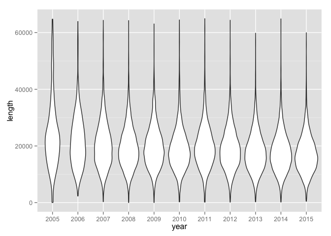

# R test
Adam Pearce  


Load data from URL

```r
require(data.table)
```

```
## Loading required package: data.table
```

```r
library(ggplot2)
library(dplyr)
```

```
## 
## Attaching package: 'dplyr'
## 
## The following objects are masked from 'package:data.table':
## 
##     between, last
## 
## The following object is masked from 'package:stats':
## 
##     filter
## 
## The following objects are masked from 'package:base':
## 
##     intersect, setdiff, setequal, union
```

```r
calls <- fread("../data/calls2.csv")
```

```
## 
Read 12.4% of 80757 rows
Read 37.1% of 80757 rows
Read 61.9% of 80757 rows
Read 74.3% of 80757 rows
Read 99.1% of 80757 rows
Read 80757 rows and 5 (of 5) columns from 1.283 GB file in 00:00:10
```

### ggplot2 test


```r
ggplot(mpg, aes(hwy)) + geom_histogram()
```

```
## stat_bin: binwidth defaulted to range/30. Use 'binwidth = x' to adjust this.
```

 

### Use dplyr mutate to add a time and length variable to each call

```r
calls <- calls %>%
  mutate(length = nchar(text)) %>%
  mutate(dateNum = as.numeric(year) + as.numeric(substr(x = quarter, start = 2, stop = 2))/4 - .25) %>%
  filter(dateNum < 2016) %>%
  filter(length > 0)
```


### Histogram of call lengths - I've filtered out 0 length calls

```r
ggplot(calls, aes(length)) + geom_histogram(binwidth=1000)
```

 


### Histogram of call quarter - not sure why the number falls off in 2010
there were also calls after 2016 - need to check the the parsing script is working

```r
ggplot(calls, aes(dateNum)) + geom_histogram(binwidth=.25)
```

 

### Scatter of quarter v length - looks like adverage length is decreasing

```r
ggplot(calls, aes(dateNum, length)) + geom_point() + geom_quantile(quantiles = c(.1, .25, .5, .75, .9))
```

```
## Smoothing formula not specified. Using: y ~ x
```

 


### Violin of date v length - calls are getting shorter AND the number of very short calls is decreasing

```r
ggplot(calls, aes(year, length)) + geom_violin()
```

 
